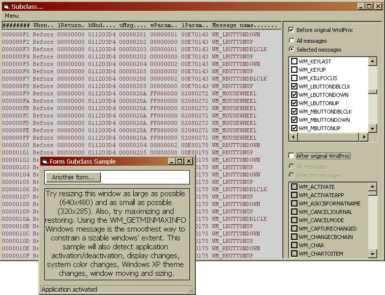



## Self\-subclassing Controls/Forms \- NO dependencies\. Updated 09/10

### Description

VB makes it easy to compile controls into an application if you have the source. It's much more convenient for users if the only file that needs to be added to the project is just the control’s ctl file. If the Control uses subclassing, then you're out of luck, or rather... you were. This submission includes the FIRST ever Control/Form that can subclass itself without ANY dependencies – modules, classes, type-libraries, references or components. The techniques used are based on my WinSubHook2 submission and thus incorporate IDE breakpoint and stop safety; it won’t crash the IDE. My main target audience here would be control authors, however, anyone who needs form subclassing may well find this to be an ideal solution. 06/02: Can now subclass multiple hWnd’s. 06/07: Byte array substituted in place of a string for the machine code buffer. 06/18: Hidden bug fixed, see comments. 06/19: Optimised to within an inch of its life. 06/20: Road to Damascus. 06/21 New sample added, see screenshot. 06/28 Final (I hope). 06/29 Oops fixed. 09/10 fixed bug in UserControl_Terminate, marked zSubclass_Proc hidden.
 
### More Info
 

             |
---                |---
**Submitted On**   |2004-06-29 09:03:02
**By**             |[Paul Caton](https://github.com/Planet-Source-Code/PSCIndex/blob/master/ByAuthor/paul-caton.md)
**Level**          |Advanced
**User Rating**    |5.0 (350 globes from 70 users)
**Compatibility**  |VB 5\.0, VB 6\.0
**Category**       |[Miscellaneous](https://github.com/Planet-Source-Code/PSCIndex/blob/master/ByCategory/miscellaneous__1-1.md)
**World**          |[Visual Basic](https://github.com/Planet-Source-Code/PSCIndex/blob/master/ByWorld/visual-basic.md)
**Archive File**   |[Self\-subcl1791639102004\.zip](https://github.com/Planet-Source-Code/paul-caton-self-subclassing-controls-forms-no-dependencies-updated-09-10__1-54117/archive/master.zip)

